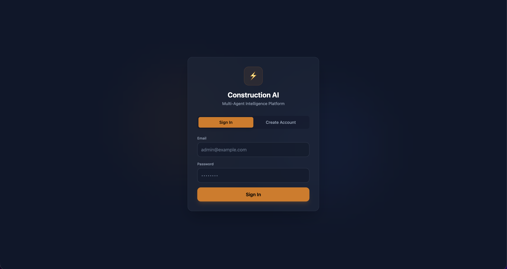
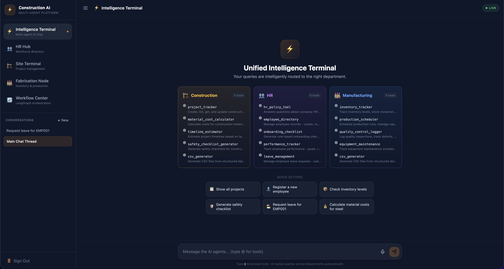
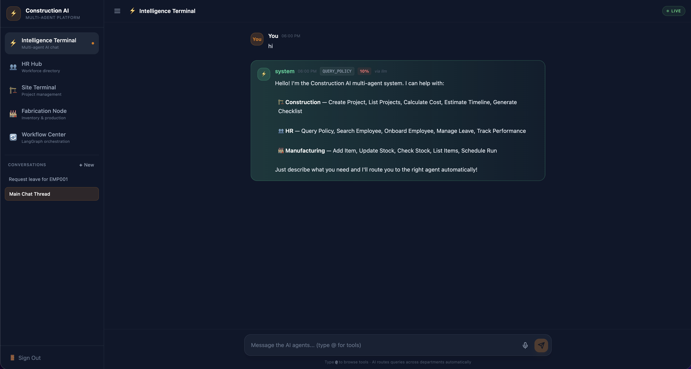
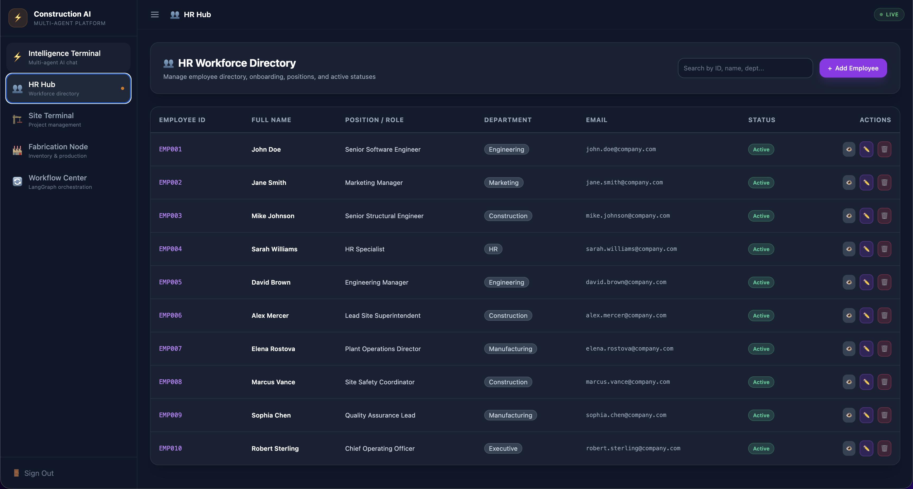
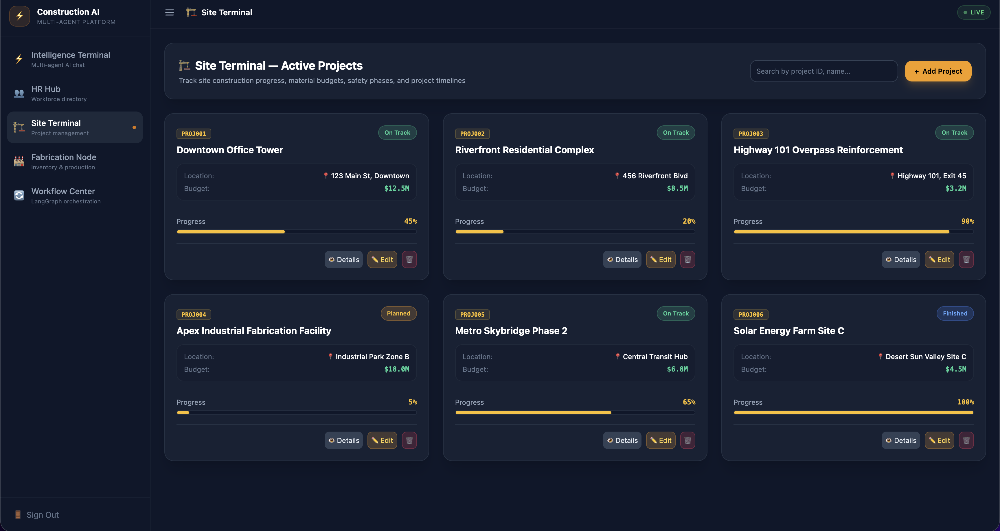
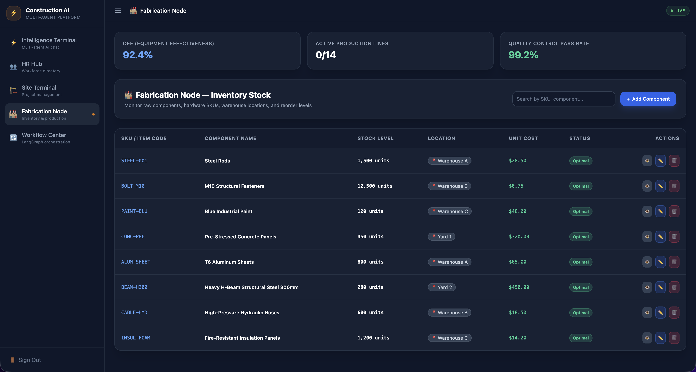
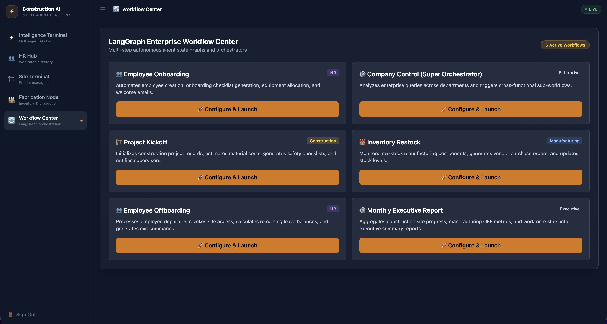

<div align="center">

# 🏗️ Construction AI Agent System
### **Enterprise Multi-Agent Platform & Autonomous LangGraph Orchestrator**

[](https://www.datadaur.com)

[](https://bun.sh)
[](https://elysiajs.com)
[](https://langchain.com)
[](https://mongodb.com)
[](https://redis.io)
[](https://opensource.org/licenses/MIT)

*Eliminating the **$177 Billion Annual Loss** in Construction Operations through Autonomous AI Multi-Agent Orchestration.*

[🏢 About Data Daur](#-sponsored--developed-by) • [🖼️ UI Showcase](#-interface--ux-showcase) • [🚀 Quick Start](#-quick-start) • [✨ Key Features](#-key-features) • [🏛️ Architecture](#-system-architecture)

---

</div>

## 🏢 Sponsored & Developed By

This open-source project is proudly sponsored, engineered, and maintained by **[Data Daur AI & ERP Consulting](https://www.datadaur.com)**.

> **Data Daur** specializes in empowering global enterprises with tailored Artificial Intelligence, autonomous multi-agent systems, data engineering pipelines, and custom ERP integration services across Construction, Manufacturing, Logistics, and Corporate Operations.
>
> 🌐 **Website**: [www.datadaur.com](https://www.datadaur.com)  
> ✉️ **Enterprise Inquiries**: [contact@datadaur.com](mailto:contact@datadaur.com)

---

## 📌 Overview

The **Construction AI Agent System** is a production-ready, open-source multi-agent platform designed to bridge information silos and automate operations across **Construction**, **Manufacturing**, and **HR** departments. 

Powered by a **Dynamic Intelligence Intent Layer (`IntelligentIntentLayer.ts`)** harvesting live tool schemas, **LangGraph StateGraph Workflows (v2.x)**, and the **Issa Group Enterprise Knowledge Base & Policy Engine**, the system dynamically classifies user queries (*"What is our WFH policy, onboard Sarah as an engineer, order 500 steel beams, and estimate site timeline"*) into parallel or sequential execution tasks across specialized AI agents.

---

## 🖼️ Interface & UX Showcase

<div align="center">

### 💬 1. Unified Intelligence Terminal & `@`-Mention Autocomplete
*Full-screen dark mode ChatGPT-style terminal with `@` tool autocomplete, voice-to-text speech input, and multi-thread session switcher.*



<br/>

### 👥 2. HR Workforce Directory Hub
*Interactive employee directory featuring Employee IDs (`EMP001`), live search filtering, and CRUD management modals.*

| Workforce Directory Overview | Add & Edit Employee Modal |
|:----------------------------:|:-------------------------:|
|  |  |

<br/>

### 🏗️ 3. Site Terminal — Construction Hub
*Real-time construction project tracking featuring Project IDs (`PRJ-001`), site locations, budgets, and visual progress bars.*



<br/>

### 🏭 4. Fabrication Node — Manufacturing Hub
*Plant inventory management featuring SKUs (`STEEL-001`), stock level controls, unit costs, and live OEE performance metrics.*



<br/>

### 🌐 5. LangGraph Enterprise Workflow Center
*Multi-step StateGraph orchestration wizard for executing autonomous cross-department enterprise workflows.*



<br/>

### 🔔 6. Toast Notifications & In-Chat File Downloads
*Real-time floating animated alerts (success, error, info, warning) and interactive file download cards for CSV, Excel, and PDF reports.*



</div>

---

## ✨ Key Features & Capabilities

```
┌───────────────────────────────────────────────────────────────────────────────────────────┐
│                                   🌟 PLATFORM HIGHLIGHTS                                  │
├───────────────────────────────┬───────────────────────────────┬───────────────────────────┤
│ 🏗️ Construction Agent        │ 🏭 Manufacturing Agent        │ 👥 HR Agent               │
│ • Project Tracker & CRUD      │ • Inventory Tracker & SKUs    │ • Employee Directory CRUD │
│ • Material Cost Calculator    │ • OEE Production Metrics      │ • Onboarding Checklists   │
│ • Timeline Estimator          │ • Quality Control Logging     │ • Vacation & Leave Balances│
│ • OSHA Safety Checklists      │ • Equipment Maintenance       │ • Performance Trackers    │
├───────────────────────────────┼───────────────────────────────┼───────────────────────────┤
│ 🌐 LangGraph Workflows        │ 🎨 Terminal & User Experience │ 📄 Reports & Exports      │
│ • Company Control Orchestration│ • `@` Tool Autocomplete Menu  │ • CSV Export Generator    │
│ • 15-Step Employee Onboarding │ • 🎙️ Voice-to-Text Speech     │ • Excel Sheet Exporter    │
│ • Project Kickoff Pipelines   │ • 💬 Multi-Thread Sessions    │ • PDF Document Renderer   │
│ • Inventory Restock Trigger   │ • 🔔 Animated Toast Alerts    │ • In-Chat Download Cards  │
└───────────────────────────────┴───────────────────────────────┴───────────────────────────┘
```

---

## 🏛️ System Architecture

```
                       [ User / Web Terminal UI (React 18 + Vite) ]
                                            │
                      ┌─────────────────────┴─────────────────────┐
                      ▼                                           ▼
        ⚡ Fast REST Agent Router                    🌐 LangGraph Workflow Center
       (Groq LLM + 429 Retry Backoff)               (StateGraph Workflow Engine)
                      │                                           │
       ┌──────────────┼──────────────┐             ┌──────────────┼──────────────┐
       ▼              ▼              ▼             ▼              ▼              ▼
 🏗️ Construction    👥 HR     🏭 Manufacturing  Kickoff     Onboarding     Control
    Agent          Agent          Agent       Workflow      Workflow      Workflow
       │              │              │             │              │              │
       └──────────────┴──────────────┴─────────────┴──────────────┴──────────────┘
                                            │
                               ┌────────────┴────────────┐
                               ▼                         ▼
                       🍃 MongoDB 7.5            ⚡ Redis 5.11
                     (Text Indexes Active)     (Session Token Cache)
```

---

## 🚀 Quick Start

### 1. Prerequisites
- **[Bun Runtime](https://bun.sh)** (`>= 1.0`)
- **[Docker & Docker Compose](https://www.docker.com/)**

### 2. Clone & Setup Repository

```bash
# Clone the open-source repository
git clone https://github.com/tayyabmughal676/Construction_AI_Agent.git
cd Construction_AI_Agent

# Install dependencies for backend and frontend
bun install
cd frontend && bun install && cd ..
```

### 3. Configure Environment Variables

```bash
cp .env.example .env
```

*Default environment parameters:*
```env
PORT=3000
MONGODB_URI=mongodb://localhost:27017/multi-ai-agency
MONGODB_DB_NAME=multi-ai-agency
REDIS_HOST=localhost
REDIS_PORT=6379
GROQ_API_KEY=your_groq_api_key_here
JWT_SECRET=super_secret_jwt_key_2026
```

### 4. Start Infrastructure & Seed Demo Data

```bash
# Start MongoDB & Redis Docker containers
docker-compose up -d

# Seed database with rich enterprise demo data
bun run seed
```

### 5. Launch Application

```bash
# Run both Backend API server & Frontend UI concurrently
bun run dev
```

- **Backend API**: `http://localhost:3000`
- **Frontend UI**: `http://localhost:5173`
- **Demo Admin Credentials**: `admin@example.com` / `admin123`
- **Demo User Credentials**: `user@example.com` / `user123`

---

## 📖 API Reference & Example Workflows

### ⚡ Agent Natural Language Chat

`POST /api/agents/chat`

```bash
curl -X POST http://localhost:3000/api/agents/chat \
  -H "Content-Type: application/json" \
  -H "Authorization: Bearer <YOUR_JWT_TOKEN>" \
  -d '{"message": "@project_tracker list all active sites"}'
```

### 🌐 LangGraph Company Control Super Orchestrator

`POST /api/workflows/langgraph/company-control`

```bash
curl -X POST http://localhost:3000/api/workflows/langgraph/company-control \
  -H "Content-Type: application/json" \
  -H "Authorization: Bearer <YOUR_JWT_TOKEN>" \
  -d '{"context":{"message":"Onboard Sarah as engineer and check steel beam stock"}}'
```

### 📊 Available REST Endpoints

| Endpoint | Method | Description |
|---|---|---|
| `/api/auth/login` | `POST` | Authenticate user & receive JWT token |
| `/api/agents/capabilities` | `GET` | Retrieve system capabilities & active tools |
| `/api/agents/chat` | `POST` | Execute natural language query via Intelligent Router |
| `/api/hr/employees` | `GET/POST/PUT/DELETE` | Full CRUD operations for workforce directory |
| `/api/construction/projects` | `GET/POST/PUT/DELETE` | Full CRUD operations for construction sites |
| `/api/manufacturing/inventory` | `GET/POST/PUT/DELETE` | Full CRUD operations for plant inventory |
| `/api/workflows/list` | `GET` | List available LangGraph StateGraph workflows |
| `/api/files/:type/:filename` | `GET` | Download generated CSV, Excel, or PDF reports |

---

## 📂 Repository Structure

```
.
├── frontend/                 # React 19 + Vite + TailwindCSS Modular UI Application
│   ├── src/
│   │   ├── types/            # Shared TypeScript type definitions
│   │   ├── constants/        # Department themes, icons, navigation, & suggestion chips
│   │   ├── services/         # Centralized API client (ApiService)
│   │   ├── hooks/            # Custom hooks (useAuth, useChatThreads, useSpeechRecognition, useMentionTools)
│   │   ├── components/       # UI Components
│   │   │   ├── auth/         # AuthScreen (Login / Registration)
│   │   │   ├── layout/       # Sidebar & Header layout chrome
│   │   │   ├── chat/         # ChatTerminal, MessageItem, FileDownloadCard, ChatInput, WelcomeScreen
│   │   │   └── Hubs/Modals   # HR, Construction, Manufacturing, Workflow, ApprovalModal, DeleteModal, Toast
│   │   ├── App.tsx           # Declarative Root Orchestrator
│   │   └── main.tsx          # ToastProvider & React entry
├── screenshots/              # UI/UX Screenshots & Gallery
├── src/                      # Elysia.js Hardened Backend Application
│   ├── agents/               # Domain Agents, Registry & Dynamic Intent Layer
│   ├── config/               # Logger, env validator, and capability configurations
│   ├── db/                   # MongoDB client, text indexes, models & Redis connection
│   ├── middleware/           # Auth, RBAC, and rate limiting security middleware
│   ├── routes/               # API endpoint route handlers (auth, agents, v2graph, hubs, files)
│   ├── services/             # Groq LLM & LM Studio AI integration
│   ├── tools/                # 16 specialized domain, communication & exporter tools
│   ├── workflows/langgraph/  # LangGraph v2 MultiAgentSwarmGraph & 6 enterprise workflows
│   └── seed.ts               # Enterprise database seeder
├── test/                     # 54 Automated Unit & Security Test Suites
├── docker-compose.yml        # Local MongoDB & Redis stack
├── AGENTS.md                 # Agent architecture & tool specifications
├── CHANGELOG.md              # Project version release history
├── SECURITY.md               # Full Security Vulnerability Assessment & Resolution Matrix
├── v2-work.md                # 2-Phase V2 Swarm Engine roadmap
└── README.md                 # Project documentation
```

---

## 🤝 Contributing to Open Source

Contributions are warmly welcomed! Please follow these steps:

1. Fork the repository
2. Create a feature branch (`git checkout -b feature/amazing-feature`)
3. Commit your changes (`git commit -m 'Add amazing feature'`)
4. Verify TypeScript compilation (`bun test` and `npx tsc --noEmit`)
5. Push to the branch (`git push origin feature/amazing-feature`)
6. Open a Pull Request

---

## 📝 License

Distributed under the **MIT License**. See `LICENSE` for more information.

<div align="center">

---

### **Sponsored & Developed by Data Daur AI & ERP Consulting**

🌐 **[www.datadaur.com](https://www.datadaur.com)** • ✉️ **[contact@datadaur.com](mailto:contact@datadaur.com)**

*Built with ❤️ for the Global Construction & Industrial Sector*

</div>
